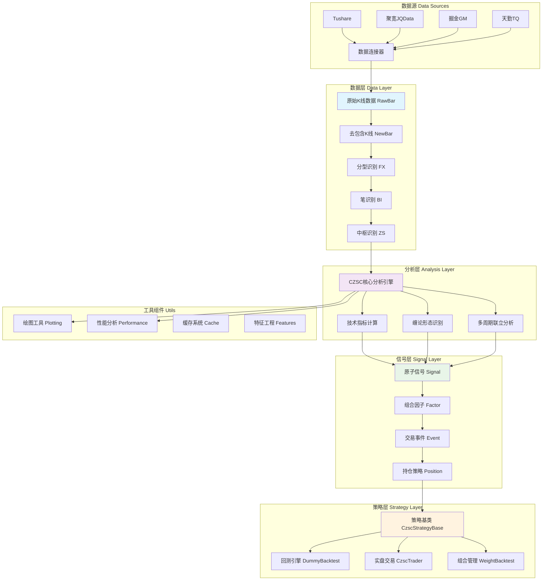

## 项目概述

CZSC（缠中说禅）是一个基于缠中说禅理论的量化交易分析工具库，专注于技术分析中的分型、笔、中枢等核心概念的程序化实现。本库提供了完整的`信号-因子-事件-交易`量化交易逻辑体系，支持多周期联立决策分析。

## 🏗️ 系统架构



## 🧩 核心概念详解

### 1. 数据结构体系

#### 基础K线结构
- **RawBar**: 原始K线数据，包含开高低收量额等基础信息
- **NewBar**: 经过包含关系处理的K线，是后续分析的基础

#### 缠论核心结构
- **FX (分型)**: 顶分型(G)和底分型(D)，三根K线形成的局部极值点
- **BI (笔)**: 连接相邻异性分型的线段，是缠论分析的基本单位
- **ZS (中枢)**: 至少由三笔构成的价格重叠区间，表示多空力量平衡区域

### 2. 信号系统架构

#### 信号分层设计
```python
# 信号定义示例
Signal(k1="30分钟", k2="倒0笔", k3="方向", v1="向上", v2="任意", v3="任意", score=0)

# 因子组合示例  
Factor(
    signals_all=[Signal("30分钟_D1_表里关系V230101_向上_任意_任意_0")],
    signals_any=[],
    signals_not=[]
)

# 事件定义示例
Event(
    operate=Operate.LO,  # 开多
    factors=[factor1, factor2]
)
```

#### 信号分类体系
- **cxt**: 缠论技术信号（分型、笔、中枢相关）
- **tas**: 技术分析信号（MACD、MA、KDJ等传统指标）
- **bar**: K线形态信号（单根或多根K线模式）
- **vol**: 成交量相关信号
- **byi**: 买卖点信号
- **jcc**: 技术形态信号

### 3. 策略构建流程

```python
class MyStrategy(CzscStrategyBase):
    def __init__(self, **kwargs):
        super().__init__(**kwargs)
    
    @property
    def positions(self):
        # 定义开仓条件
        opens = [Event.load({
            "operate": "开多",
            "factors": [{
                "signals_all": ["30分钟_D1_表里关系V230101_向上_任意_任意_0"]
            }]
        })]
        
        # 定义平仓条件  
        exits = [Event.load({
            "operate": "平多",
            "factors": [{
                "signals_all": ["30分钟_D1_表里关系V230101_向下_任意_任意_0"]
            }]
        })]
        
        return [Position(
            symbol=self.symbol,
            opens=opens,
            exits=exits,
            interval=3600*4,  # 开仓间隔
            timeout=16*30,    # 超时平仓
            stop_loss=500     # 止损基点
        )]
```

## 📊 股票因子开发指南

### 1. 因子开发流程

#### Step 1: 信号函数开发
```python
def custom_signal_V240101(c: CZSC, **kwargs) -> OrderedDict:
    """自定义信号函数示例
    
    :param c: CZSC对象
    :param kwargs: 参数配置
    :return: 信号字典
    """
    di = int(kwargs.get("di", 1))
    freq = c.freq.value
    
    # 获取分析所需数据
    if len(c.bi_list) < di + 2:
        return create_single_signal(k1=freq, k2=f"D{di}", k3="自定义信号V240101", v1="其他")
    
    bi = c.bi_list[-di]  # 获取倒数第di笔
    
    # 信号计算逻辑
    if bi.direction == Direction.Up and bi.power > 50:
        v1 = "强势向上"
    elif bi.direction == Direction.Down and bi.power > 50:
        v1 = "强势向下"
    else:
        v1 = "其他"
    
    return create_single_signal(k1=freq, k2=f"D{di}", k3="自定义信号V240101", v1=v1)
```

#### Step 2: 因子验证与分析
```python
from czsc import SignalAnalyzer

# 配置信号参数网格
signals_config = [
    {'name': 'custom_signal_V240101', 'freq': '30分钟', 'di': 1},
    {'name': 'custom_signal_V240101', 'freq': '60分钟', 'di': 1},
]

# 执行信号验证
sa = SignalAnalyzer(
    symbols=symbols,
    read_bars=get_raw_bars,
    signals_config=signals_config,
    results_path="./signal_analysis"
)
sa.execute(max_workers=8)
```

#### Step 3: 因子组合与策略构建
```python
def create_factor_strategy(symbol, **kwargs):
    """基于多因子的策略构建"""
    
    # 多因子开多条件
    long_factors = [
        {
            "signals_all": [
                "30分钟_D1_自定义信号V240101_强势向上_任意_任意_0",
                "30分钟_D1_MACD背驰V221201_底背驰_任意_任意_0"
            ],
            "signals_not": ["30分钟_D1_涨跌停V230331_涨停_任意_任意_0"]
        }
    ]
    
    # 多因子开空条件
    short_factors = [
        {
            "signals_all": [
                "30分钟_D1_自定义信号V240101_强势向下_任意_任意_0",
                "30分钟_D1_MACD背驰V221201_顶背驰_任意_任意_0"
            ],
            "signals_not": ["30分钟_D1_涨跌停V230331_跌停_任意_任意_0"]
        }
    ]
    
    opens = [
        {"operate": "开多", "factors": long_factors},
        {"operate": "开空", "factors": short_factors}
    ]
    
    return Position(
        symbol=symbol,
        opens=[Event.load(x) for x in opens],
        exits=[],
        interval=3600*2,
        timeout=20*30,
        stop_loss=300
    )
```

### 2. 常用信号函数库

#### 缠论核心信号
```python
# 笔方向信号
"30分钟_D1_表里关系V230101_向上_任意_任意_0"  # 当前笔向上
"30分钟_D1_表里关系V230101_向下_任意_任意_0"  # 当前笔向下

# 中枢信号
"30分钟_D1_三买形态V230228_一买_任意_任意_0"  # 三买点
"30分钟_D1_三买形态V230228_三买_任意_任意_0"  # 一买点

# 背驰信号
"30分钟_D1_MACD背驰V221201_底背驰_任意_任意_0"  # MACD底背驰
"30分钟_D1_MACD背驰V221201_顶背驰_任意_任意_0"  # MACD顶背驰
```

#### 技术指标信号
```python
# MACD相关
"30分钟_D1_MACD快慢线V221101_多头_任意_任意_0"  # MACD多头排列
"30分钟_D1_MACD快慢线V221101_空头_任意_任意_0"  # MACD空头排列

# MA均线系统
"30分钟_D1_MA5V221101_向上_任意_任意_0"  # MA5向上
"30分钟_D1_双均线V221203_多头_任意_任意_0"  # 双均线多头

# 布林带
"30分钟_D1_布林带突破V221112_上轨突破_任意_任意_0"  # 布林上轨突破
"30分钟_D1_布林带突破V221112_下轨突破_任意_任意_0"  # 布林下轨突破
```

### 3. 回测与性能评估

#### 策略回测
```python
# 执行回测
trader = strategy.replay(
    bars=bars,
    sdt='20210101',
    edt='20231201', 
    res_path="./backtest_results"
)

# 获取交易记录
trades = trader.positions[0].pairs
results = trader.positions[0].evaluate()

print(f"总收益率: {results['总收益率']:.2%}")
print(f"年化收益率: {results['年化收益率']:.2%}")
print(f"最大回撤: {results['最大回撤']:.2%}")
print(f"夏普比率: {results['夏普比率']:.2f}")
```

#### 批量测试
```python
from czsc.traders import DummyBacktest

# 批量回测多个标的
symbols = get_symbols('中证500成分股')[:50]
results = []

for symbol in symbols:
    try:
        bars = get_raw_bars(symbol, freq='30分钟', sdt='20200101', edt='20231201')
        strategy = MyStrategy(symbol=symbol)
        trader = strategy.replay(bars, sdt='20210101')
        performance = trader.positions[0].evaluate()
        results.append({
            'symbol': symbol,
            'return': performance['总收益率'],
            'sharpe': performance['夏普比率'],
            'max_dd': performance['最大回撤']
        })
    except Exception as e:
        logger.error(f"{symbol} 回测失败: {e}")

# 统计分析
df_results = pd.DataFrame(results)
print(f"平均收益率: {df_results['return'].mean():.2%}")
print(f"胜率: {(df_results['return'] > 0).mean():.2%}")
```

## 🔧 开发环境配置

### 数据源配置
```python
# tushare配置
import tushare as ts
ts.set_token('your_tushare_token')

# 聚宽配置  
import jqdatasdk as jq
jq.auth('username', 'password')

# 使用数据连接器
from czsc.connectors import research
symbols = research.get_symbols('中证500成分股')
bars = research.get_raw_bars(symbol, freq='30分钟', sdt='20200101')
```

### 可视化配置
```python
# 使用内置绘图工具
from czsc import CZSC
from czsc.utils import KlineChart

# 创建分析对象
czsc = CZSC(bars, max_bi_num=50)

# 生成交互式图表
kline = KlineChart(czsc, width="1400px", height="580px")
kline.open_in_browser()

# 或使用plotly
fig = czsc.to_plotly()
fig.show()
```

## 📈 高级功能

### 1. 多周期联立分析
```python
class MultiTimeframeStrategy(CzscStrategyBase):
    def __init__(self, **kwargs):
        super().__init__(**kwargs)
        # 配置多个分析周期
        self.freqs = ['5分钟', '30分钟', '日线']
    
    @property  
    def positions(self):
        # 多周期条件组合
        opens = [{
            "operate": "开多",
            "factors": [{
                "signals_all": [
                    "5分钟_D1_表里关系V230101_向上_任意_任意_0",   # 5分钟向上
                    "30分钟_D1_表里关系V230101_向上_任意_任意_0",  # 30分钟向上
                    "日线_D1_表里关系V230101_向上_任意_任意_0"     # 日线向上
                ]
            }]
        }]
        return [Position(symbol=self.symbol, opens=[Event.load(x) for x in opens])]
```

### 2. 动态止盈止损
```python
from czsc.traders import stoploss_by_direction

def dynamic_stop_loss(trader, bar):
    """动态止损逻辑"""
    for pos in trader.positions:
        if pos.operates:
            latest_op = pos.operates[-1]
            # 根据市场波动调整止损
            if latest_op['operate'] in ['开多', '加多']:
                # 使用ATR动态调整止损点
                atr_stop = calculate_atr_stop(bar, period=14, multiplier=2.0)
                pos.stop_loss = max(pos.stop_loss, atr_stop)
```

### 3. 组合权重管理
```python
from czsc.traders import WeightBacktest

# 多策略组合
strategies = [
    MyStrategy(symbol=symbol, name='策略A'),
    AnotherStrategy(symbol=symbol, name='策略B'),
]

# 权重回测
wb = WeightBacktest(
    strategies=strategies,
    weights=[0.6, 0.4],  # 策略权重
    rebalance_freq='月度'  # 再平衡频率
)

results = wb.backtest(sdt='20210101', edt='20231201')
```

## 🎯 最佳实践

### 1. 信号开发规范
- 信号函数命名: `模块_功能_版本号` (如: `tas_macd_base_V221101`)
- 参数标准化: 使用kwargs传递参数，提供默认值
- 返回格式: 统一使用OrderedDict格式
- 文档注释: 详细说明信号含义、参数说明、使用示例

### 2. 策略开发规范
- 模块化设计: 将开平仓逻辑分离，便于单独测试和优化
- 参数外置: 关键参数通过配置文件管理，避免硬编码
- 异常处理: 完善的错误处理机制，确保策略稳定运行
- 版本控制: 策略版本化管理，记录修改历史

### 3. 回测注意事项
- 数据质量: 确保使用高质量、无未来函数的历史数据
- 手续费成本: 根据实际交易成本设置合理的手续费率
- 滑点影响: 考虑市场冲击成本对策略收益的影响
- 过拟合风险: 避免过度优化参数，注重样本外验证
