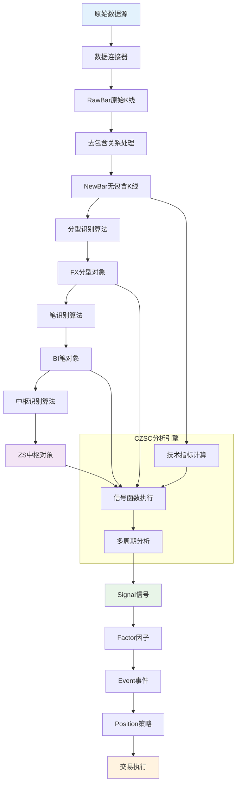

# CZSC 代码架构详解

## 📁 项目目录结构

```
czsc/
├── __init__.py                 # 主模块导入
├── analyze.py                  # 核心分析引擎（CZSC类）
├── objects.py                  # 基础数据结构定义
├── enum.py                     # 枚举类型定义
├── strategies.py               # 策略基类
├── cmd.py                      # 命令行工具
├── envs.py                     # 环境配置
├── eda.py                      # 探索性数据分析
├── aphorism.py                 # 缠论名言警句
├── connectors/                 # 数据连接器
│   ├── ts_connector.py         # Tushare数据源
│   ├── jq_connector.py         # 聚宽数据源
│   ├── gm_connector.py         # 掘金数据源
│   ├── tq_connector.py         # 天勤数据源
│   └── research.py             # 研究用数据接口
├── signals/                    # 信号函数库
│   ├── cxt.py                  # 缠论技术信号
│   ├── tas.py                  # 技术分析信号
│   ├── bar.py                  # K线形态信号
│   ├── vol.py                  # 成交量信号
│   ├── byi.py                  # 买卖点信号
│   └── jcc.py                  # 技术形态信号
├── utils/                      # 工具函数
│   ├── ta.py                   # 技术指标计算
│   ├── cache.py                # 缓存系统
│   ├── plotly_plot.py          # Plotly绘图
│   ├── echarts_plot.py         # ECharts绘图
│   ├── stats.py                # 统计分析
│   ├── trade.py                # 交易相关工具
│   └── st_components.py        # Streamlit组件
├── traders/                    # 交易引擎
│   ├── base.py                 # 交易器基类
│   ├── sig_parse.py            # 信号解析器
│   ├── dummy_backtest.py       # 虚拟回测
│   └── weight_backtest.py      # 权重回测
├── sensors/                    # 传感器模块
├── features/                   # 特征工程
├── fsa/                       # 有限状态自动机
└── data/                      # 数据文件
```

## 🔄 数据流程架构



## 🏗️ 核心模块详解

### 1. 数据结构模块 (objects.py)

#### 基础K线结构
```python
@dataclass
class RawBar:
    """原始K线元素"""
    symbol: str          # 标的代码
    id: int             # 唯一ID，必须升序
    dt: datetime        # 时间戳
    freq: Freq          # 周期
    open: float         # 开盘价
    close: float        # 收盘价
    high: float         # 最高价
    low: float          # 最低价
    vol: float          # 成交量
    amount: float       # 成交额
    cache: dict         # 缓存字典

@dataclass
class NewBar:
    """去除包含关系后的K线元素"""
    # ... 基本字段同RawBar
    elements: List      # 包含的原始K线列表
```

#### 缠论核心结构
```python
@dataclass
class FX:
    """分型对象"""
    symbol: str
    dt: datetime
    mark: Mark          # G(顶分型) 或 D(底分型)
    high: float
    low: float
    fx: float           # 分型值
    elements: List      # 构成分型的K线

@dataclass
class BI:
    """笔对象"""
    symbol: str
    fx_a: FX           # 起始分型
    fx_b: FX           # 结束分型
    fxs: List          # 笔内分型列表
    direction: Direction # 方向：Up/Down
    bars: List[NewBar]  # 构成笔的K线
    
    @property
    def power(self):
        """笔的力度（价差）"""
        return abs(self.fx_b.fx - self.fx_a.fx)

@dataclass  
class ZS:
    """中枢对象"""
    bis: List[BI]      # 构成中枢的笔列表
    
    @property
    def zg(self):
        """中枢上沿"""
        return min([bi.high for bi in self.bis[:3]])
    
    @property
    def zd(self):
        """中枢下沿"""
        return max([bi.low for bi in self.bis[:3]])
```

#### 信号体系结构
```python
@dataclass
class Signal:
    """原子信号"""
    k1: str = "任意"    # 周期标识
    k2: str = "任意"    # 参数标识
    k3: str = "任意"    # 功能标识
    v1: str = "任意"    # 信号值1
    v2: str = "任意"    # 信号值2
    v3: str = "任意"    # 信号值3
    score: int = 0      # 信号强度(0-100)

@dataclass
class Factor:
    """因子 = 信号组合"""
    signals_all: List[Signal]   # 必须全部满足
    signals_any: List[Signal]   # 满足任一即可
    signals_not: List[Signal]   # 不能满足任一

@dataclass
class Event:
    """事件 = 因子集合"""
    operate: Operate    # 操作类型：开多/开空/平多/平空
    factors: List[Factor]

class Position:
    """持仓策略"""
    def __init__(self, symbol, opens, exits, **kwargs):
        self.symbol = symbol
        self.opens = opens      # 开仓事件列表
        self.exits = exits      # 平仓事件列表
        self.interval = kwargs.get('interval', 0)
        self.timeout = kwargs.get('timeout', 1000)
        self.stop_loss = kwargs.get('stop_loss', 1000)
```

### 2. 分析引擎模块 (analyze.py)

#### CZSC核心类
```python
class CZSC:
    """缠中说禅分析核心引擎"""
    
    def __init__(self, bars: List[RawBar], **kwargs):
        self.bars_raw = []          # 原始K线序列
        self.bars_ubi = []          # 未完成笔的K线序列
        self.bi_list = []           # 笔序列
        self.fx_list = []           # 分型序列
        
        # 处理初始数据
        for bar in bars:
            self.update(bar)
    
    def update(self, bar: RawBar):
        """更新一根K线"""
        self.bars_raw.append(bar)
        self.__update_bi()          # 更新笔识别
        
    def __update_bi(self):
        """更新笔识别逻辑"""
        # 1. 处理包含关系
        # 2. 识别分型
        # 3. 连接成笔
        # 4. 识别中枢
```

#### 核心算法实现
```python
def remove_include(k1: NewBar, k2: NewBar, k3: RawBar):
    """去除包含关系算法"""
    # 确定方向
    if k1.high < k2.high:
        direction = Direction.Up
    elif k1.high > k2.high:
        direction = Direction.Down
    else:
        # 创建新K线
        return False, NewBar(...)
    
    # 判断是否存在包含关系
    if (k2.high <= k3.high and k2.low >= k3.low) or \
       (k2.high >= k3.high and k2.low <= k3.low):
        # 按方向处理包含关系
        if direction == Direction.Up:
            high = max(k2.high, k3.high)
            low = max(k2.low, k3.low)
        else:
            high = min(k2.high, k3.high)
            low = min(k2.low, k3.low)
        # ... 构造新K线
        return True, k4
    else:
        return False, NewBar(...)

def check_fx(k1: NewBar, k2: NewBar, k3: NewBar):
    """分型识别算法"""
    fx = None
    # 顶分型判断
    if k1.high < k2.high > k3.high and k1.low < k2.low > k3.low:
        fx = FX(mark=Mark.G, high=k2.high, low=k2.low, fx=k2.high, ...)
    
    # 底分型判断  
    if k1.low > k2.low < k3.low and k1.high > k2.high < k3.high:
        fx = FX(mark=Mark.D, high=k2.high, low=k2.low, fx=k2.low, ...)
    
    return fx

def check_bi(bars: List[NewBar]):
    """笔识别算法"""
    fxs = check_fxs(bars)  # 获取分型序列
    if len(fxs) < 2:
        return None, bars
    
    fx_a = fxs[0]
    # 寻找符合条件的结束分型
    if fx_a.mark == Mark.D:
        # 向上笔：寻找更高的顶分型
        fx_b = max([fx for fx in fxs if fx.mark == Mark.G and fx.fx > fx_a.fx], 
                   key=lambda x: x.high, default=None)
    else:
        # 向下笔：寻找更低的底分型
        fx_b = min([fx for fx in fxs if fx.mark == Mark.D and fx.fx < fx_a.fx],
                   key=lambda x: x.low, default=None)
    
    # 验证成笔条件
    if fx_b and validate_bi_conditions(fx_a, fx_b, bars):
        return BI(fx_a=fx_a, fx_b=fx_b, ...), remaining_bars
    else:
        return None, bars
```

### 3. 信号函数模块 (signals/)

#### 信号函数标准结构
```python
def signal_function_V240101(c: CZSC, **kwargs) -> OrderedDict:
    """信号函数标准模板
    
    :param c: CZSC分析对象
    :param kwargs: 参数字典
    :return: 信号字典
    """
    # 1. 参数解析
    di = int(kwargs.get("di", 1))
    param1 = kwargs.get("param1", default_value)
    
    # 2. 基础检查
    freq = c.freq.value
    k1, k2, k3 = freq, f"D{di}", "功能描述V240101"
    
    if len(c.bi_list) < di + 5:
        return create_single_signal(k1=k1, k2=k2, k3=k3, v1="其他")
    
    # 3. 核心逻辑
    bi = c.bi_list[-di]
    # ... 信号计算逻辑
    
    # 4. 返回结果
    return create_single_signal(k1=k1, k2=k2, k3=k3, v1=signal_value)
```

#### 主要信号分类

**缠论技术信号 (cxt.py)**
```python
# 笔方向信号
def cxt_bi_status_V230101(c: CZSC, **kwargs):
    """笔状态信号：判断当前笔的方向"""
    
# 中枢信号  
def cxt_zhong_shu_gong_zhen_V221221(c: CZSC, **kwargs):
    """中枢共振信号"""
    
# 买卖点信号
def cxt_third_buy_V230228(c: CZSC, **kwargs):
    """三买信号识别"""
```

**技术分析信号 (tas.py)**
```python
# MACD信号
def tas_macd_base_V221028(c: CZSC, **kwargs):
    """MACD基础信号"""
    
# 均线信号
def tas_ma_base_V221101(c: CZSC, **kwargs):
    """均线系统信号"""
    
# 布林带信号
def tas_boll_power_V221112(c: CZSC, **kwargs):
    """布林带力度信号"""
```

### 4. 策略框架模块 (strategies.py & traders/)

#### 策略基类
```python
class CzscStrategyBase:
    """策略基类"""
    
    def __init__(self, symbol, **kwargs):
        self.symbol = symbol
        self.base_freq = kwargs.get('base_freq', '30分钟')
        self.freqs = kwargs.get('freqs', ['5分钟', '30分钟', '日线'])
        
    @property
    def positions(self) -> List[Position]:
        """子类必须实现的持仓策略"""
        raise NotImplementedError
        
    @property
    def signals_config(self):
        """获取策略所需的信号配置"""
        configs = []
        for pos in self.positions:
            configs.extend(pos.get_signals_config())
        return configs
        
    def replay(self, bars, sdt=None, edt=None, **kwargs):
        """策略回测"""
        from czsc.traders import CzscTrader
        trader = CzscTrader(...)
        # 执行回测逻辑
        return trader
```

#### 交易引擎
```python
class CzscTrader:
    """缠论交易引擎"""
    
    def __init__(self, strategy, **kwargs):
        self.strategy = strategy
        self.positions = []
        self.signals = {}
        
    def update(self, bar: RawBar):
        """更新一根K线数据"""
        # 1. 更新CZSC分析
        # 2. 计算信号
        # 3. 检查开平仓条件
        # 4. 执行交易
        
    def on_bar(self, bar: RawBar):
        """K线更新回调"""
        self.update_signals(bar)
        self.check_positions(bar)
        
    def update_signals(self, bar: RawBar):
        """更新信号计算"""
        for czsc in self.czscs.values():
            czsc.update(bar)
            # 计算各种信号
            
    def check_positions(self, bar: RawBar):
        """检查持仓状态"""
        for pos in self.positions:
            pos.update(self.signals)
```

### 5. 工具模块 (utils/)

#### 技术指标计算 (ta.py)
```python
def MACD(close: np.array, fastperiod=12, slowperiod=26, signalperiod=9):
    """MACD指标计算"""
    
def SMA(close: np.array, timeperiod=20):
    """简单移动平均"""
    
def BOLL(close: np.array, timeperiod=20, nbdevup=2, nbdevdn=2):
    """布林带指标"""
```

#### 绘图工具 (plotly_plot.py)
```python
class KlineChart:
    """K线图表类"""
    
    def __init__(self, czsc: CZSC, **kwargs):
        self.czsc = czsc
        self.fig = self.create_chart()
        
    def create_chart(self):
        """创建交互式图表"""
        # Plotly图表构建逻辑
        
    def add_signals(self, signals: dict):
        """添加信号标记"""
        
    def show(self):
        """显示图表"""
```

#### 性能分析 (stats.py)
```python
def daily_performance(trades: List[dict]) -> dict:
    """日收益率分析"""
    
def net_value_stats(nav: List[float]) -> dict:
    """净值统计分析"""
    
def holds_performance(holds: List[dict]) -> dict:
    """持仓表现分析"""
```

## 🔌 接口规范

### 1. 数据连接器接口
```python
class DataConnector:
    """数据连接器基类"""
    
    def get_symbols(self, name: str) -> List[str]:
        """获取标的列表"""
        
    def get_raw_bars(self, symbol: str, freq: str, sdt: str, edt: str) -> List[RawBar]:
        """获取K线数据"""
        
    def get_adjustfactor(self, symbol: str, sdt: str, edt: str) -> pd.DataFrame:
        """获取复权因子"""
```

### 2. 信号函数接口
```python
SignalFunction = Callable[[CZSC, dict], OrderedDict]

# 标准签名
def signal_func(c: CZSC, **kwargs) -> OrderedDict:
    """
    :param c: CZSC分析对象
    :param kwargs: 参数字典，包含di, freq等
    :return: 信号字典，格式为 {signal_name: signal_value}
    """
```

### 3. 策略接口
```python
class Strategy:
    """策略接口"""
    
    @property
    def positions(self) -> List[Position]:
        """返回持仓策略列表"""
        
    def get_signals_config(self) -> List[dict]:
        """返回所需信号配置"""
        
    def replay(self, bars: List[RawBar], **kwargs) -> 'Trader':
        """执行策略回测"""
```

## 🚀 扩展指南

### 1. 自定义数据源
```python
class MyDataConnector:
    def get_raw_bars(self, symbol, freq, sdt, edt):
        # 实现自定义数据获取逻辑
        return bars
```

### 2. 自定义信号函数
```python
def my_signal_V240101(c: CZSC, **kwargs):
    # 实现自定义信号逻辑
    return create_single_signal(k1=freq, k2=key, k3=name, v1=value)
```

### 3. 自定义策略
```python
class MyStrategy(CzscStrategyBase):
    @property
    def positions(self):
        # 定义开平仓逻辑
        return [Position(...)]
```

这个架构设计遵循了模块化、可扩展、易测试的原则，为量化交易提供了完整的技术框架支持。 